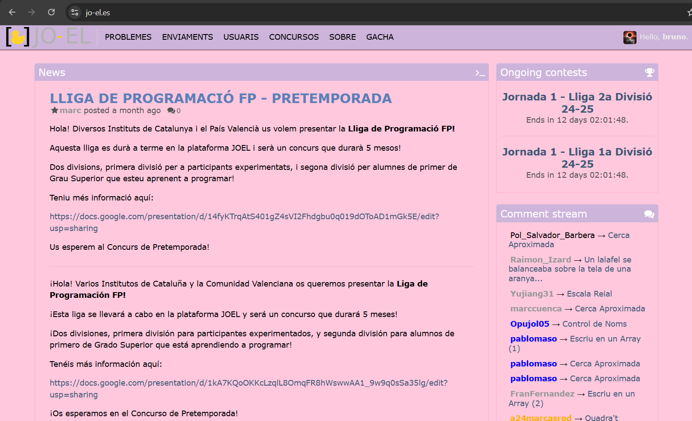
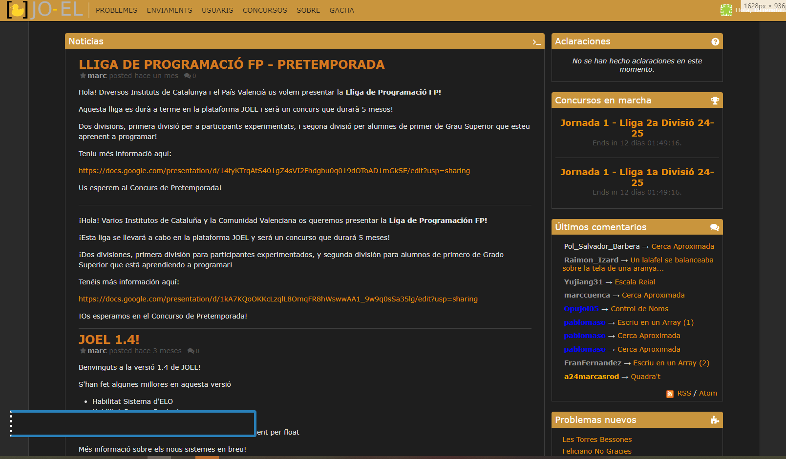
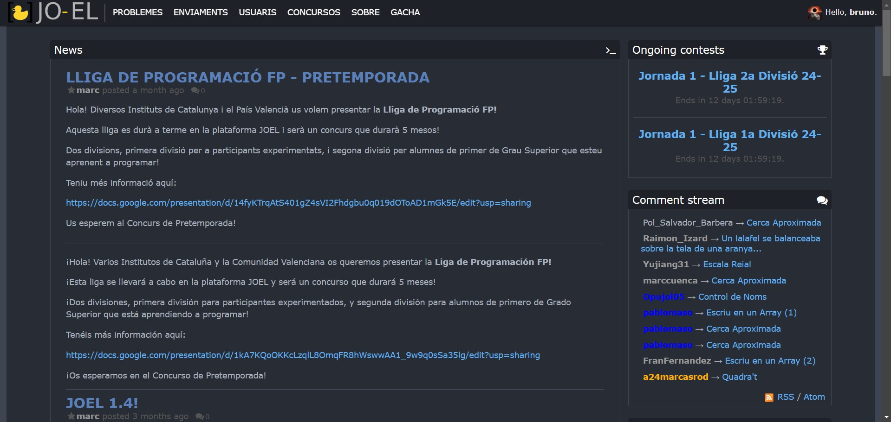
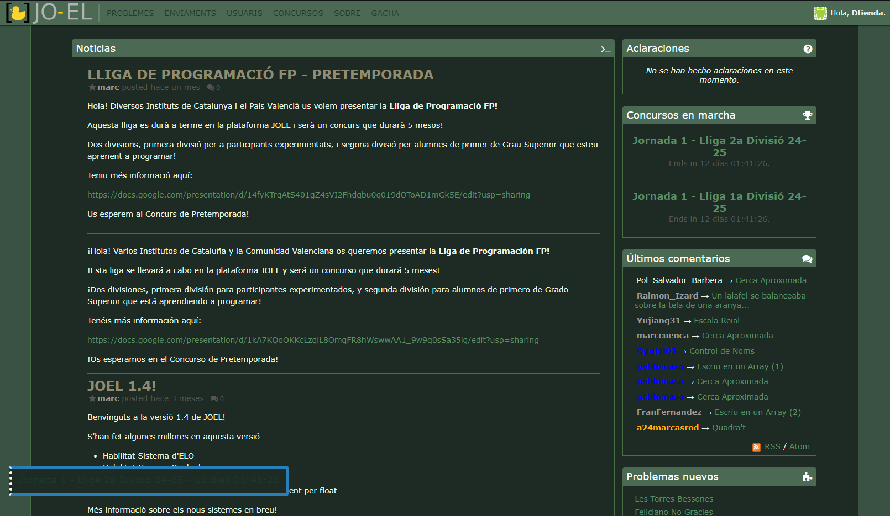
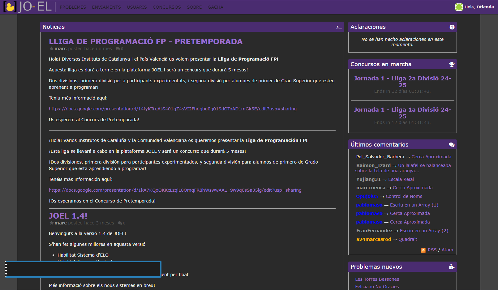
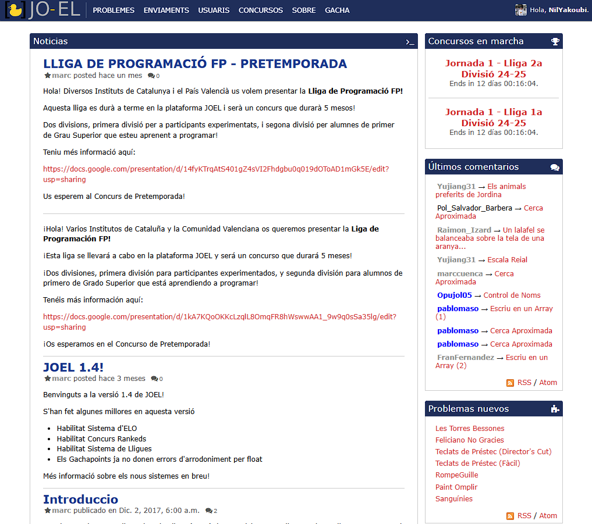

# 🎨 Ajustes de Temas/Colores para el JO-EL

## Hey Marc! 👋

Este repo contiene todas las correcciones que hemos hecho a los temas y colores de la plataforma de programación del instituto. Quería asegurarme de que la interfaz se vea mucho mejor, sea más fácil de leer y tenga buen contraste para que no nos cansemos la vista.

---
### 🔍 Resumen de Cambios

- **Más contraste**: Ahora se lee mejor y es más cómodo para los ojos.
- **Colores corregidos**: Me aseguré de que los colores no se mezclen o tengan problemas de accesibilidad.
- **El diseño gráfico es mi pasion**: Los temas son de un alto nivel de diseño gráfico, esperemos que los disfrutes.

### 💻 Temas Disponibles

- **Tema Candy Mejorado**
  
  
- **Tema Oscuro Mejorado**
  
  
- **Tema Atom One Dark**
  
  
- **Tema Gran Arbol Sabio**
  
  
- **Tema DTPurple**
  
  
- **Tema BUBIMan**
  

### 🤝 Contribuciones

Si ves algo que se pueda mejorar o tienes ideas nuevas, ¡dínoslo! Todo aporte es bienvenido.

### 📬 Comentarios

Cualquier cosa, mándanos un mensaje y lo revisamos juntos. ¡Espero que te guste!
